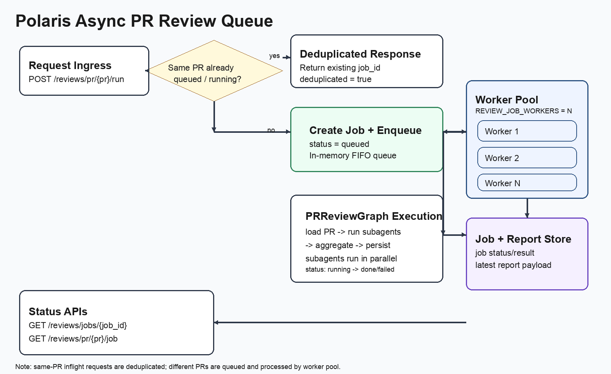
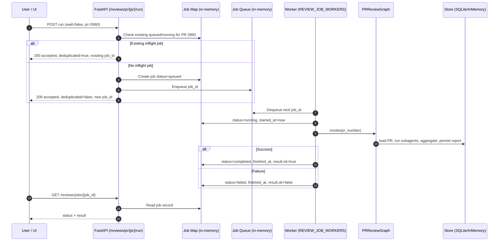
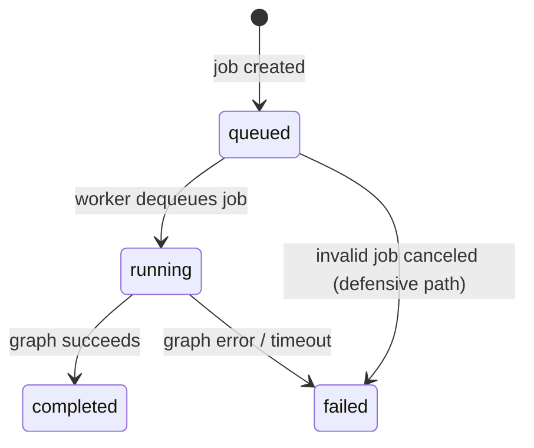
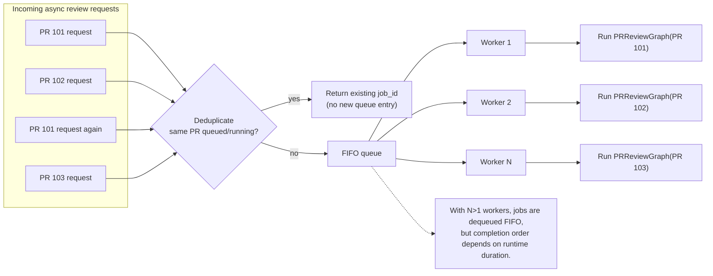
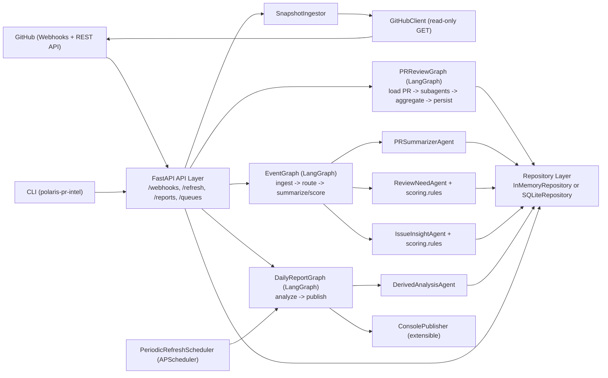

# PR Intelligence

An intelligent GitHub repository monitoring service that leverages LangGraph and LLM agents to automate PR review prioritization, issue tracking, and refresh-driven reporting. Originally built for Apache Polaris, but configurable for any GitHub repository.

License: Apache-2.0. See [LICENSE](LICENSE).

## Architecture Notes

- [Agent Build](docs/agent-build.md) explains the repo as a real agent workflow system, including how a future chatbot or ChatOps front end should fit on top of the existing graphs and APIs.

## Key Features

### 🎯 Intelligent PR Prioritization
- **Smart scoring rules** consider short-term staleness (24h/72h), long-inactive PR downgrades, diff size, file count, and explicit review requests
- **Activity trend tracking** highlights bursts like "5 comments in last 24h" on active PRs
- **Configurable thresholds** let you tune what qualifies as "needs review"
- **Target reviewer tracking**: automatically highlight PRs assigned to specific team members

### 🤖 Multi-Provider LLM Support
- **Local CLI providers**: Claude Code, Codex (code-aware with local repo context)
- **Custom skills**: separate prompts for deep PR reviews vs. batch report analysis
- **Optional self-review**: local CLI providers can run a 3-step critique-and-revise review flow for higher quality results (see [below](#self-review-feature-experimental))

## Quick Start

### 1) Setup + run
```bash
./run.sh bootstrap

export PR_INTEL_GITHUB_TOKEN=your_read_only_token
export LOCAL_REVIEW_REPO_DIR=/path/to/apache/polaris
./run.sh serve
```

`run.sh` now prefers `uv` automatically when installed, and falls back to `.venv` otherwise.

Open:
- `http://127.0.0.1:8080/ui` (dashboard)
- `http://127.0.0.1:8080/docs` (API docs)

### Which command updates what?

- **Full refresh (recommended):**
```bash
./run.sh refresh
```
This is the one-stop command that:
- Syncs open PRs/issues from GitHub
- Prunes stale locally-open PRs no longer open on GitHub
- Recomputes review/issue priority scores using deterministic scoring rules
- Runs post-sync derived analysis in a batched LLM call for the top PR slice
- Persists one structured analysis run plus its derived artifacts

- **View the latest report:**
```bash
./run.sh report
```
Prints the latest markdown report (read-only, fast).
The markdown is rendered from the latest persisted analysis run rather than read from a separately persisted report row.

To generate a fresh report first:
```bash
./run.sh refresh  # Update everything
./run.sh report   # View the report
```

### 2) Typical workflow
```bash
# 1. Full refresh (sync + score + analyze + report)
./run.sh refresh

# 2. View the latest report
./run.sh report

# 3. Queue a deep review for a specific PR (async)
./run.sh review 123

# 4. Or run a blocking review that waits for completion (sync)
./run.sh review-sync 123
```

**Note:** The review commands require the API server to be running in another terminal:
```bash
# Terminal 1: Start server
./run.sh serve

# Terminal 2: Run commands
./run.sh refresh
./run.sh review 123
```

### 3) Common curl equivalents
```bash
# Full refresh (sync + score + analyze + report)
curl -X POST "http://127.0.0.1:8080/refresh"

# View latest report (read-only)
curl "http://127.0.0.1:8080/reports/daily/latest.md"

# Async deep review
curl -X POST "http://127.0.0.1:8080/reviews/pr/123/run"

# Check latest job by PR number
curl "http://127.0.0.1:8080/reviews/pr/123/job"

# Sync deep review
curl -X POST "http://127.0.0.1:8080/reviews/pr/123/run?wait=true"
```

## `run.sh` Commands

```bash
./run.sh serve                # start API server
./run.sh refresh              # full refresh: sync + score + analyze + report
./run.sh report               # view latest markdown report (read-only)
./run.sh review 123           # async deep review for PR 123
./run.sh review-sync 123      # sync deep review for PR 123
./run.sh bootstrap            # install dependencies (uv if available, else .venv)
```

Override host/port:
```bash
PORT=9090 ./run.sh serve
```

## Required Configuration

### Required
- `PR_INTEL_GITHUB_TOKEN`
- `LOCAL_REVIEW_REPO_DIR` (required when using local CLI providers: `claude_code_local` / `codex_local`)

`PR_INTEL_GITHUB_TOKEN` is the preferred project-specific variable. `GITHUB_TOKEN` is still accepted as a backward-compatible fallback during migration.

### Common optional
- `GITHUB_OWNER` (default: `apache`)
- `GITHUB_REPO` (default: `polaris`)
- `GITHUB_WEBHOOK_SECRET` (optional; for webhook signature verification)
- `STORE_BACKEND` (default: `sqlite`; options: `sqlite`, `memory`)
- `SQLITE_PATH` (default: `.data/polaris_pr_intel.db`)
- `REVIEW_JOB_WORKERS` (default: `1`; number of parallel async PR review workers. Increase for higher concurrency.)
- `REVIEW_JOB_TIMEOUT_SEC` (default: `1200`; max time in seconds for a review job before marking as failed)
- `ANALYSIS_TOP_SLICE_LIMIT` (default: `10`; reserved for future slicing logic and currently not used by `DerivedAnalysisAgent`)
- `ENABLE_SELF_REVIEW` (default: `true`; enable the 3-step self-review process for PR reviews on local CLI providers. See [Self-Review Feature](#self-review-feature-experimental) below.)
- `ENABLE_PERIODIC_REFRESH` (default: `true`; enable automatic periodic refresh scheduler)
- `REFRESH_TIMEZONE` (optional; IANA timezone for the automatic refresh window, for example `America/Los_Angeles`. Defaults to the system local timezone.)
- `REFRESH_INTERVAL_MINUTES` (default: `30`; minutes between automatic refreshes during the local refresh window)
- `REFRESH_START_HOUR_LOCAL` (default: `8`; first local hour included in the automatic refresh window)
- `REFRESH_END_HOUR_LOCAL` (default: `23`; last local top-of-hour refresh in the automatic refresh window)

### LLM provider selection
- `LLM_PROVIDER` (default: `claude_code_local`)
  - supported: `heuristic`, `claude_code_local`, `codex_local`
  - `heuristic` means rule-based local scoring/review only; it does not call Claude, Codex, or any hosted LLM
- `LLM_MODEL` (optional; provider-specific default when unset)
  - `codex_local` default: `gpt-5.4`
  - known Codex model ids to use here: `gpt-5.4`, `gpt-5.4-mini`, `gpt-5-codex`
  - model availability can vary by OpenAI/Codex account; check the OpenAI model docs if a configured id is rejected
- `REVIEW_SKILL_FILE` (optional; skill used by individual PR review prompts)
- `ANALYSIS_SKILL_FILE` (optional; skill used by post-sync report-analysis prompts)

Current limitation:
- attention ranking via `ANALYSIS_SKILL_FILE` is LLM-backed only for `claude_code_local` and `codex_local`

### Local Claude Code provider
- `CLAUDE_CODE_CMD` (default: `claude`)
- `CLAUDE_CODE_TIMEOUT_SEC` (default: `300`)
- `CLAUDE_CODE_MAX_TURNS` (default: `15`)

### Local Codex provider
- `CODEX_CMD` (default: `codex`)
- `CODEX_TIMEOUT_SEC` (default: `900`)
- `CODEX_MAX_TURNS` (default: `15`)
- `CODEX_REASONING_EFFORT` (default: `medium`; passed through to `codex exec`, so valid values are model-specific)

### Scoring knobs
- `REVIEW_NEEDED_THRESHOLD` (default: `2.0`)
- `REVIEW_TARGET_LOGIN` (optional; used as a reviewer-specific signal in analysis and reporting. It no longer filters `GET /queues/needs-review`, which is now a repo-wide prioritized queue sourced from persisted attention analysis.)
- `ISSUE_INTERESTING_THRESHOLD` (default: `2.0`)
- `REVIEW_STALE_24H_POINTS` (default: `1.5`)
- `REVIEW_STALE_72H_POINTS` (default: `1.5`)
- `REVIEW_INACTIVE_DAYS` (default: `7`; PRs with no activity past this age are downgraded)
- `REVIEW_INACTIVE_PENALTY_POINTS` (default: `2.0`)
- `REVIEW_ACTIVITY_HOT_COMMENTS_24H_THRESHOLD` (default: `5`)
- `REVIEW_ACTIVITY_HOT_POINTS` (default: `1.5`)
- `REVIEW_ACTIVITY_WARM_COMMENTS_24H_THRESHOLD` (default: `2`)
- `REVIEW_ACTIVITY_WARM_POINTS` (default: `0.75`)
- `REVIEW_REQUESTED_POINTS` (default: `2.0`)
- `REVIEW_LARGE_DIFF_POINTS` (default: `1.5`)
- `REVIEW_MEDIUM_DIFF_POINTS` (default: `1.0`)
- `REVIEW_MANY_FILES_POINTS` (default: `1.0`)

## API Overview

### Core Workflow
- `POST /refresh` - Full refresh: sync + score + analyze + report (recommended)

### Reports
- `GET /reports/daily/latest.md` - Latest generated report (markdown rendered from the latest persisted analysis run)

### PR Reviews (Deep Analysis)
- `POST /reviews/pr/{pr_number}/run` - Async review (returns immediately)
- `POST /reviews/pr/{pr_number}/run-sync` - Sync review (waits for result)
- `GET /reviews/pr/{pr_number}/job` - Get job status by PR number
- `GET /reviews/jobs/{job_id}` - Get job status by job ID
- `GET /reviews/pr/{pr_number}/latest` - Latest review result (JSON)
- `GET /reviews/pr/{pr_number}/latest.md` - Latest review result (markdown with PR metadata, review analysis, and findings)
- `GET /reviews/pr/{pr_number}/latest.html` - Latest review result (rendered HTML page)
- `GET /reviews/pr/top` - Top-rated reviews

### Queues
- `GET /queues/needs-review` - PRs needing review (repo-wide prioritized queue from the latest persisted attention analysis run; not filtered by `REVIEW_TARGET_LOGIN`)
- `GET /queues/interesting-issues` - Interesting issues (prioritized)

### Other
- `GET /` - API index
- `GET /ui` - Web dashboard
- `GET /docs` - OpenAPI documentation
- `GET /healthz` - Health check
- `GET /stats` - Service statistics
- `POST /webhooks/github` - GitHub webhook receiver

## Skills System

The service uses **two separate skill files** for different analysis tasks:

1. **`skills/polaris-pr-review/skill.md`** (individual PR reviews)
   - Used by `PRReviewGraph` for deep, single-PR analysis
   - Invoked via `/reviews/pr/{pr_number}/run`
   - Runs multi-turn LLM conversations with subagents for comprehensive code review

2. **`skills/polaris-attention-analysis/skill.md`** (post-sync report analysis)
   - Used by `DailyReportGraph` for batch analysis across all open PRs
   - Invoked via `/refresh`
   - Processes multiple PRs in a single LLM call for efficiency
   - Persists structured attention analysis and generates derived markdown/artifacts from that persisted run

This separation allows:
- Different prompting strategies for deep vs. broad analysis
- Independent skill evolution for different use cases
- Better cost/performance trade-offs per task type

## Self-Review Feature (Experimental)

The service includes an optional **multi-step self-review** capability that improves PR review quality through LLM critique and revision.
This path is implemented by the local CLI adapters (`claude_code_local` and `codex_local`).
The `heuristic` provider uses a single-pass rule-based review instead of the 3-step LLM self-review flow.

### How It Works

When enabled on a local CLI adapter, PR reviews use a 3-step self-review process:

1. **Generate** - LLM produces initial review findings (same as normal)
2. **Critique** - LLM examines its own findings against quality criteria:
   - **Specificity**: Are recommendations actionable with file:line references?
   - **Coverage**: Were all critical checks from skill.md addressed?
   - **Consistency**: Do verdicts align with scores? Any contradictions?
   - **Clarity**: Is language clear and concise without hedging?
3. **Revise** - LLM regenerates findings addressing the critique issues

Each step is a separate LLM invocation. If critique or revision fails, the system falls back to the initial findings.

### When to Use

**Enable self-review when:**
- Review quality is more important than speed
- You're doing targeted reviews on critical PRs
- You have budget for 3x LLM calls per review

**Disable it when:**
- You need fast turnaround times
- You're doing bulk/batch reviews
- Cost optimization is a priority
- Initial reviews are already sufficient

### Configuration

```bash
# Enable self-review globally
export ENABLE_SELF_REVIEW=true
./run.sh serve

# Or for a single session
ENABLE_SELF_REVIEW=true ./run.sh serve
```

### Performance Impact

- **Latency**: roughly 3x baseline for local CLI providers
- **Cost**: roughly 3x token usage for local CLI providers
- **Quality**: Significantly improved specificity, coverage, and consistency

### Monitoring

When self-review is enabled, logs show the 3-step process:
```
[INFO] Step 1/3: Generating initial review for PR #123
[INFO] Step 2/3: Critiquing initial findings for PR #123
[INFO] Step 3/3: Revising findings based on critique for PR #123
[INFO] Self-review complete for PR #123: 4 findings revised
```

If any step fails, you'll see fallback warnings:
```
[WARNING] Step 2 (critique) failed, using initial findings: <error>
```

### A/B Testing

To compare quality with/without self-review:

```bash
# Baseline review
export ENABLE_SELF_REVIEW=false
./run.sh review 123
curl http://127.0.0.1:8080/reviews/pr/123/latest.md > baseline.md

# Self-reviewed
export ENABLE_SELF_REVIEW=true
./run.sh review 123
curl http://127.0.0.1:8080/reviews/pr/123/latest.md > self-reviewed.md

# Compare
diff baseline.md self-reviewed.md
```

Look for improvements in:
- More specific file:line references in recommendations
- Better coverage of all critical checks
- Aligned verdicts and scores
- Clearer, more concise language

## Provider Notes

- Adapter layer is provider-agnostic.
- Local providers (`claude_code_local`, `codex_local`) use your local repo path for code-aware analysis.
- The local providers are the only adapters that currently execute real external LLM/tooling calls.
- Individual PR review and post-sync report analysis intentionally use different prompt paths and different skills.
- Post-sync report analysis batches the current open PR set into one LLM call instead of one call per PR.
- If CLI execution fails or output parsing fails, adapters fall back to deterministic rule-based output.
- Async review jobs are queued in-memory (not persisted).
- Repeated async requests for the same PR while a job is `queued`/`running` are deduplicated and return the existing `job_id` (`deduplicated: true`).
- The service logs the configured LLM provider at startup and logs each CLI LLM invocation.

### Async Review Queue (Detailed)









## Architecture (Reference)

### Features
- **GitHub webhook ingestion** (`pull_request`, `issues`, `issue_comment`, `pull_request_review`)
- **LangGraph event pipeline** (summarization + deterministic scoring)
- **LangGraph PR deep review pipeline** (subagents + aggregation)
- **Post-sync derived analysis pipeline** for attention reports and catalog routing
- **FastAPI REST API** with interactive UI and documentation
- **SQLite default persistence** (with in-memory option for testing)
- **Async review queue** with configurable worker count for parallel processing

### Code layout
```
src/polaris_pr_intel/
├── api/              # FastAPI application and REST endpoints
├── github/           # GitHub REST API client (read-only)
├── graphs/           # LangGraph workflows
│   ├── event_graph.py         # Event ingestion → summarize → score
│   ├── daily_report_graph.py  # Analysis → report generation
│   └── pr_review_graph.py     # Load PR → subagents → aggregate → persist
├── agents/           # Task-specific agents
│   ├── pr_summarizer.py       # PR summarization
│   ├── review_need.py         # Review priority scoring
│   ├── issue_insight.py       # Issue priority scoring
│   ├── pr_reviewer.py         # Deep PR review orchestration
│   ├── derived_analysis.py    # Post-sync batch analysis
├── llm/              # Provider-agnostic LLM adapter layer
│   ├── base.py                # LLM interface
│   ├── adapters.py            # Claude Code, Codex, API providers
│   └── factory.py             # Provider instantiation
├── store/            # Repository layer (SQLite + in-memory)
├── scoring/          # Deterministic scoring rules
├── scheduler/        # APScheduler periodic refresh scheduling
├── config.py         # Environment-based configuration
└── main.py           # CLI entrypoint

skills/
├── polaris-pr-review/        # Individual PR review skill
└── polaris-attention-analysis/  # Batch PR attention analysis skill

tests/                         # Test suite (pytest)
```



## Development

### Running Tests
```bash
# Install test dependencies
./run.sh bootstrap

# Run test suite
pytest tests/

# Run with coverage
pytest --cov=polaris_pr_intel tests/
```

### Project Structure
- **Python 3.11+** required
- **uv** recommended for faster dependency management (auto-detected by `run.sh`)
- **pyproject.toml** defines project metadata and dependencies
- **uv.lock** locks exact dependency versions
- **.venv/** virtual environment (if not using uv)

### Adding New Features
1. **New agent**: Add to `src/polaris_pr_intel/agents/`
2. **New graph workflow**: Add to `src/polaris_pr_intel/graphs/`
3. **New API endpoint**: Extend `src/polaris_pr_intel/api/app.py`
4. **New LLM provider**: Implement in `src/polaris_pr_intel/llm/adapters.py`

## Troubleshooting

### Common Issues

**Missing GitHub token**
```
RuntimeError: PR_INTEL_GITHUB_TOKEN or GITHUB_TOKEN is required
```
→ Prefer `export PR_INTEL_GITHUB_TOKEN=your_token_here` before running

**LOCAL_REVIEW_REPO_DIR required for local providers**
```
RuntimeError: LOCAL_REVIEW_REPO_DIR must be set for claude_code_local provider
```
→ When using `claude_code_local` or `codex_local`, you must set:
```bash
export LOCAL_REVIEW_REPO_DIR=/path/to/your/local/repo
```
→ This directory should be a git clone of the repo you're monitoring

**Server won't start / Port in use**
```
ERROR: [Errno 48] Address already in use
```
→ Change the port:
```bash
PORT=9090 ./run.sh serve
```

**Review jobs timeout**
```
Job timeout after 1200s
```
→ Increase timeout for large PRs:
```bash
export REVIEW_JOB_TIMEOUT_SEC=2400  # 40 minutes
```

**SQLite database locked**
→ Ensure only one server instance is running. Check for zombie processes:
```bash
ps aux | grep polaris-pr-intel
kill <pid>
```

**LLM provider errors**
- Verify your API keys are set correctly
- Check `claude`, `codex`, or other CLI tools are in PATH for local providers
- Review logs for detailed error messages
- Switch to the rule-based local provider for testing: `export LLM_PROVIDER=heuristic`

**Self-review taking too long**
```
Step 2/3: Critiquing initial findings for PR #123
(hangs for minutes)
```
→ Self-review makes 3 LLM calls instead of 1. Expected latency is ~3x baseline.
→ Increase timeout if needed: `export REVIEW_JOB_TIMEOUT_SEC=2400`
→ Or disable self-review: `export ENABLE_SELF_REVIEW=false`

**Self-review falling back to initial findings**
```
[WARNING] Step 2 (critique) failed, using initial findings
```
→ This is expected behavior when critique/revision fails (LLM error, timeout, parse failure)
→ The review still completes successfully with initial findings
→ Check logs for specific error details
→ If persistent, disable self-review or adjust timeout

**Webhook signature verification fails**
→ Ensure `GITHUB_WEBHOOK_SECRET` matches your GitHub webhook configuration

### Debug Mode
Enable verbose logging by checking application logs when running the server. The service logs:
- LLM provider at startup
- Each CLI LLM invocation
- Webhook events received
- Review job status changes

### Data Storage
- SQLite database: `.data/polaris_pr_intel.db` (default)
- Change location: `export SQLITE_PATH=/path/to/db.sqlite`
- Use in-memory storage for testing: `export STORE_BACKEND=memory`
