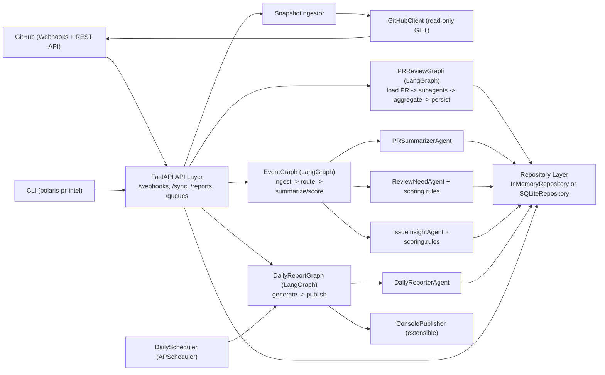

# Polaris PR Intelligence (LangGraph + GitHub API)

Python service for monitoring `apache/polaris` pull requests and issues, scoring review priority, running LLM subagent deep reviews, and generating daily reports.

## Quick Start

### 1) Setup + run
```bash
./run.sh bootstrap

export GITHUB_TOKEN=your_read_only_token
export LOCAL_REVIEW_REPO_DIR=/path/to/apache/polaris
./run.sh serve
```

`run.sh` now prefers `uv` automatically when installed, and falls back to `.venv` otherwise.

Open:
- `http://127.0.0.1:8080/ui` (dashboard)
- `http://127.0.0.1:8080/docs` (API docs)

### Which command updates what?

- Update **New/Updated PRs Today** tab data (from latest PR snapshots) and recompute queues:
```bash
./run.sh sync-all
```

- Generate/update **Latest Report** tab content:
```bash
./run.sh report
```
By default this runs refresh first (`refresh=true`) with full sync-all semantics:
- sync open PRs/issues
- prune stale locally-open PRs no longer open on GitHub
- recompute review/issue signals
- then generate the report markdown

- Full refresh (recommended):
```bash
./run.sh sync-all
./run.sh report
```

### 2) Typical workflow
```bash
# 1. sync data
./run.sh sync-all

# 2. run deep review on one PR (async)
./run.sh review 123

# 3. or sync review on one PR (wait for result)
./run.sh review-sync 123

# 4. generate report
./run.sh report
```

### 3) Common curl equivalents
```bash
# sync all open PRs/issues
curl -X POST "http://127.0.0.1:8080/sync/all-open?per_page=100&max_pages=20"
# (default) also marks stale locally-open PRs as closed when no longer in GitHub open list
# (default) also recomputes needs-review / interesting-issues queues

# recompute needs-review / interesting-issues queues
curl -X POST "http://127.0.0.1:8080/scores/recompute"

# async deep review
curl -X POST "http://127.0.0.1:8080/reviews/pr/123/run"

# check latest job by PR number
curl "http://127.0.0.1:8080/reviews/pr/123/job"

# sync deep review
curl -X POST "http://127.0.0.1:8080/reviews/pr/123/run?wait=true"

# generate report
curl -X POST "http://127.0.0.1:8080/reports/daily/run"
# (default: refresh=true, recompute=true, prune_missing_open_prs=true)

# latest markdown report
curl "http://127.0.0.1:8080/reports/daily/latest.md"
```

## `run.sh` Commands

```bash
./run.sh serve                # start API server
./run.sh sync-all             # sync all open PRs/issues + recompute review/issue signals
./run.sh sync                 # sync recent PRs/issues
./run.sh report               # generate + print daily report
./run.sh review 123           # async deep review for PR 123
./run.sh review-sync 123      # sync deep review for PR 123
./run.sh run-daily            # run daily graph via CLI
./run.sh bootstrap            # install dependencies (uv if available, else .venv)
./run.sh install              # sync/install dependencies
```

Override host/port:
```bash
PORT=9090 ./run.sh serve
```

## Required Configuration

### Required
- `GITHUB_TOKEN`
- `LOCAL_REVIEW_REPO_DIR` (required when using local CLI providers: `claude_code_local` / `codex_local`)

### Common optional
- `GITHUB_OWNER` (default: `apache`)
- `GITHUB_REPO` (default: `polaris`)
- `GITHUB_WEBHOOK_SECRET` (optional)
- `STORE_BACKEND` (default: `sqlite`)
- `SQLITE_PATH` (default: `.data/polaris_pr_intel.db`)

### LLM provider selection
- `LLM_PROVIDER` (default: `claude_code_local`)
  - supported: `heuristic`, `openai`, `gemini`, `anthropic`, `claude_code_local`, `codex_local`
- `LLM_MODEL` (optional; provider-specific default when unset)

### Local Claude Code provider
- `CLAUDE_CODE_CMD` (default: `claude`)
- `CLAUDE_CODE_TIMEOUT_SEC` (default: `300`)
- `CLAUDE_CODE_MAX_TURNS` (default: `15`)

### Local Codex provider
- `CODEX_CMD` (default: `codex`)
- `CODEX_TIMEOUT_SEC` (default: `300`)
- `CODEX_MAX_TURNS` (default: `15`)

### Scoring knobs
- `REVIEW_NEEDED_THRESHOLD` (default: `2.0`)
- `REVIEW_TARGET_LOGIN` (optional; if this login is in `requested_reviewers`, PR is always included in "PRs Needing Review")
- `ISSUE_INTERESTING_THRESHOLD` (default: `2.0`)
- `REVIEW_STALE_24H_POINTS` (default: `1.5`)
- `REVIEW_STALE_72H_POINTS` (default: `1.5`)
- `REVIEW_REQUESTED_POINTS` (default: `2.0`)
- `REVIEW_LARGE_DIFF_POINTS` (default: `1.5`)
- `REVIEW_MEDIUM_DIFF_POINTS` (default: `1.0`)
- `REVIEW_MANY_FILES_POINTS` (default: `1.0`)

## API Overview

- `GET /`, `GET /ui`, `GET /docs`, `GET /healthz`
- `POST /sync/recent`, `POST /sync/all-open`
- `POST /scores/recompute`
- `POST /reports/daily/run` (default refresh path uses sync-all semantics + recompute)
- `GET /reports/daily/latest`, `GET /reports/daily/latest.md`, `GET /reports/daily`
- `POST /reviews/pr/{pr_number}/run` (async by default)
- `POST /reviews/pr/{pr_number}/run-sync`
- `GET /reviews/pr/{pr_number}/job`, `GET /reviews/jobs/{job_id}`
- `GET /reviews/pr/{pr_number}/latest`, `GET /reviews/pr/top`
- `POST /reviews/run-open`
- `GET /queues/needs-review`, `GET /queues/interesting-issues`

## Provider Notes

- Adapter layer is provider-agnostic.
- Local providers (`claude_code_local`, `codex_local`) use your local repo path for code-aware analysis.
- If CLI execution fails or output parsing fails, adapters fall back to deterministic heuristic output.

## Architecture (Reference)

### Features
- GitHub webhook ingestion (`pull_request`, `issues`, `issue_comment`, `pull_request_review`)
- LangGraph event pipeline (summarization + deterministic scoring)
- LangGraph PR deep review pipeline (subagents + aggregation)
- Daily report pipeline
- FastAPI + SQLite default persistence

### Code layout
- `src/polaris_pr_intel/api` - FastAPI app
- `src/polaris_pr_intel/github` - GitHub API client
- `src/polaris_pr_intel/graphs` - LangGraph workflows
- `src/polaris_pr_intel/agents` - task agents
- `src/polaris_pr_intel/llm` - provider-agnostic LLM adapter layer
- `src/polaris_pr_intel/store` - repository layer
- `src/polaris_pr_intel/scoring` - deterministic scoring
- `src/polaris_pr_intel/scheduler` - daily scheduler


