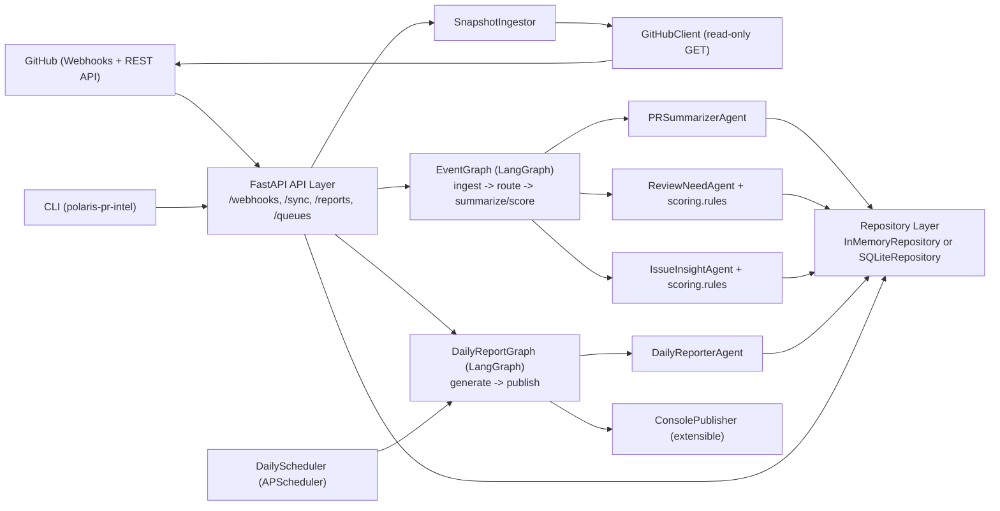
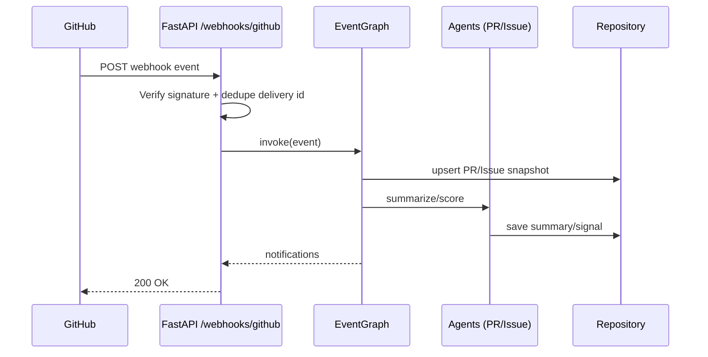
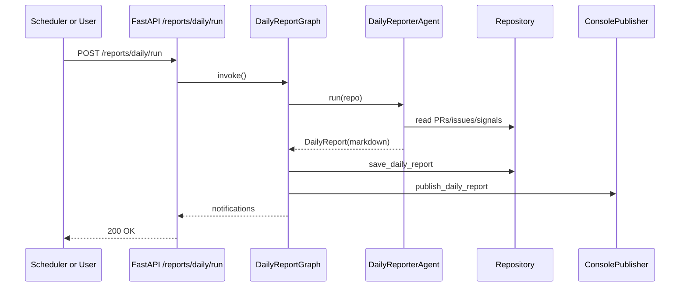

# Polaris PR Intelligence (LangGraph + GitHub API)

Minimal runnable skeleton for monitoring `apache/polaris` pull requests and issues.

## Features
- GitHub webhook ingestion (`pull_request`, `issues`, `issue_comment`, `pull_request_review`)
- LangGraph event pipeline:
  - PR summarization
  - PR needs-review scoring
  - interesting-issue scoring
- Daily report pipeline
- FastAPI service endpoints

## Layout
- `src/polaris_pr_intel/api` - FastAPI app
- `src/polaris_pr_intel/github` - GitHub API client
- `src/polaris_pr_intel/graphs` - LangGraph workflows
- `src/polaris_pr_intel/agents` - task agents
- `src/polaris_pr_intel/ingest.py` - periodic GitHub snapshot ingestion
- `src/polaris_pr_intel/scoring` - deterministic scoring
- `src/polaris_pr_intel/store` - repository layer
- `src/polaris_pr_intel/publish` - report/notification sinks
- `src/polaris_pr_intel/scheduler` - daily scheduler

## Architecture



### Component responsibilities
- **API layer**: receives webhooks, exposes manual sync/report endpoints, and serves queue/report queries.
- **EventGraph**: processes incoming PR/issue events and writes summaries/signals.
- **DailyReportGraph**: builds and publishes daily markdown reports.
- **GitHubClient**: reads PR/issue data from GitHub API.
- **Repository layer**: persists snapshots, signals, reports, and webhook idempotency keys.
- **Scheduler**: triggers daily report runs automatically.

## Sequence flows

### 1) Webhook event processing



### 2) Daily report generation



## Run
```bash
cd tools/pr-intel
python -m venv .venv
source .venv/bin/activate
pip install -e .
polaris-pr-intel serve --host 0.0.0.0 --port 8080
```

## Required env vars
- `GITHUB_TOKEN` - GitHub App installation token or PAT
- `GITHUB_OWNER` (default: `apache`)
- `GITHUB_REPO` (default: `polaris`)
- `GITHUB_WEBHOOK_SECRET` (optional)

## Storage backend
- `STORE_BACKEND` (default: `sqlite`) - `memory` or `sqlite`
- `SQLITE_PATH` (default: `.data/polaris_pr_intel.db`) - used when `STORE_BACKEND=sqlite`

## API
- `POST /webhooks/github`
- `POST /reports/daily/run`
- `POST /sync/recent`
- `GET /reports/daily/latest`
- `GET /queues/needs-review`
- `GET /queues/interesting-issues`
- `GET /healthz`
