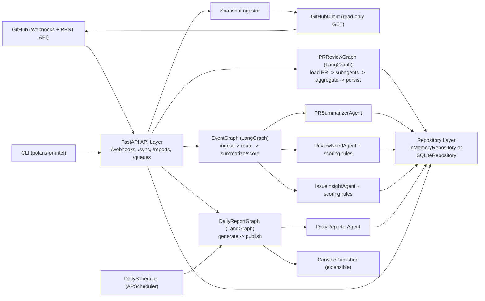
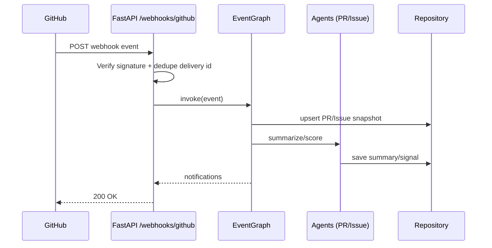
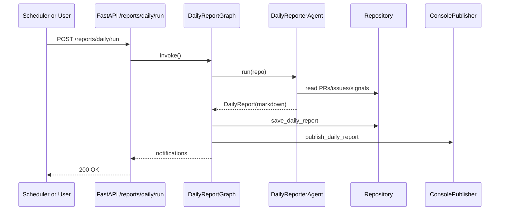
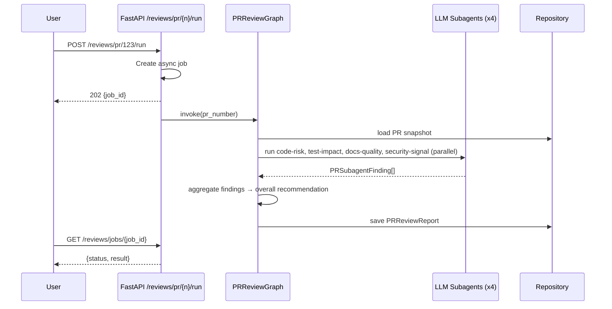

# Polaris PR Intelligence (LangGraph + GitHub API)

Python service for monitoring `apache/polaris` pull requests and issues, scoring review priority, and generating daily reports.

## Features
- GitHub webhook ingestion (`pull_request`, `issues`, `issue_comment`, `pull_request_review`)
- LangGraph event pipeline:
  - PR summarization
  - PR needs-review scoring
  - interesting-issue scoring
- Daily report pipeline
- FastAPI service endpoints
- SQLite persistence by default (`STORE_BACKEND=sqlite`)
- Provider-agnostic PR deep-review subagents (`heuristic`, `openai`, `gemini`, `anthropic`, `claude_code_local`)

## Layout
- `src/polaris_pr_intel/api` - FastAPI app
- `src/polaris_pr_intel/github` - GitHub API client
- `src/polaris_pr_intel/graphs` - LangGraph workflows
- `src/polaris_pr_intel/agents` - task agents
- `src/polaris_pr_intel/ingest.py` - periodic GitHub snapshot ingestion
- `src/polaris_pr_intel/scoring` - deterministic scoring
- `src/polaris_pr_intel/llm` - provider-agnostic LLM adapter layer
- `src/polaris_pr_intel/store` - repository layer
- `src/polaris_pr_intel/publish` - report/notification sinks
- `src/polaris_pr_intel/scheduler` - daily scheduler

## Architecture



### Component responsibilities
- **API layer**: receives webhooks, exposes manual sync/report endpoints, and serves queue/report queries.
- **EventGraph**: processes incoming PR/issue events and writes summaries/signals.
- **DailyReportGraph**: builds and publishes daily markdown reports.
- **PRReviewGraph**: runs LLM subagents (code-risk, test-impact, docs-quality, security-signal) and aggregates findings into a review report.
- **GitHubClient**: reads PR/issue data from GitHub API.
- **LLM adapters**: provider-agnostic interface for subagent analysis with heuristic fallback.
- **Repository layer**: persists snapshots, signals, reports, and webhook idempotency keys.
- **Scheduler**: triggers daily report runs automatically.

## Sequence flows

### 1) Webhook event processing



### 2) Daily report generation



### 3) PR deep review



## Run
```bash
python -m venv .venv
source .venv/bin/activate
./run.sh install
export GITHUB_TOKEN=your_read_only_token
export CLAUDE_CODE_REPO_DIR=/path/to/apache/polaris
./run.sh serve
```

Open:
- `http://127.0.0.1:8080/` (service overview)
- `http://127.0.0.1:8080/ui` (dashboard UI)
- `http://127.0.0.1:8080/docs` (interactive API)

## How to use

A `run.sh` helper script wraps common operations:

```bash
./run.sh serve                # start the API server
./run.sh sync-all             # sync all open PRs/issues from GitHub
./run.sh sync                 # sync recent PRs/issues
./run.sh report               # generate and print daily report
./run.sh review 123           # run async deep review for PR #123
./run.sh review-sync 123      # run sync deep review (wait for result)
./run.sh run-daily            # generate one daily report via CLI
./run.sh install              # pip install -e .
```

Override host/port via environment:
```bash
PORT=9090 ./run.sh serve
```

### curl examples

The same operations via curl, for scripting or when the server is remote:

Sync all open PRs/issues:
```bash
curl -X POST "http://127.0.0.1:8080/sync/all-open?per_page=100&max_pages=20"
```

Run async deep review (returns a `job_id`):
```bash
curl -X POST "http://127.0.0.1:8080/reviews/pr/123/run"
```

Check async job status:
```bash
curl "http://127.0.0.1:8080/reviews/jobs/<job_id>"
```

Run sync deep review (wait for result):
```bash
curl -X POST "http://127.0.0.1:8080/reviews/pr/123/run?wait=true"
```

Run many open PRs:
```bash
curl -X POST "http://127.0.0.1:8080/reviews/run-open?limit=50"
```

Generate daily report:
```bash
curl -X POST "http://127.0.0.1:8080/reports/daily/run"
```

View latest report:
```bash
curl "http://127.0.0.1:8080/reports/daily/latest.md"
```

Top deep review reports:
```bash
curl "http://127.0.0.1:8080/reviews/pr/top?limit=20"
```

## Required env vars
- `GITHUB_TOKEN` - GitHub App installation token or PAT
- `GITHUB_OWNER` (default: `apache`)
- `GITHUB_REPO` (default: `polaris`)
- `GITHUB_WEBHOOK_SECRET` (optional)

## Storage backend
- `STORE_BACKEND` (default: `sqlite`) - `memory` or `sqlite`
- `SQLITE_PATH` (default: `.data/polaris_pr_intel.db`) - used when `STORE_BACKEND=sqlite`

## Optional scoring config
- `REVIEW_NEEDED_THRESHOLD` (default: `2.0`)
- `ISSUE_INTERESTING_THRESHOLD` (default: `2.0`)
- `REVIEW_STALE_24H_POINTS` (default: `1.5`)
- `REVIEW_STALE_72H_POINTS` (default: `1.5`)
- `REVIEW_REQUESTED_POINTS` (default: `2.0`)
- `REVIEW_LARGE_DIFF_POINTS` (default: `1.5`)
- `REVIEW_MEDIUM_DIFF_POINTS` (default: `1.0`)
- `REVIEW_MANY_FILES_POINTS` (default: `1.0`)

## LLM subagent config
- `LLM_PROVIDER` (default: `claude_code_local`) - `heuristic`, `openai`, `gemini`, `anthropic`, `claude_code_local`
- `LLM_MODEL` (default: `claude-code-local`)
- `OPENAI_API_KEY` (optional)
- `GEMINI_API_KEY` (optional)
- `ANTHROPIC_API_KEY` (optional)
- `CLAUDE_CODE_CMD` (default: `claude`) - local Claude Code CLI command
- `CLAUDE_CODE_TIMEOUT_SEC` (default: `300`) - timeout for each subagent call
- `CLAUDE_CODE_MAX_TURNS` (default: `15`) - max agent turns per subagent review
- `CLAUDE_CODE_REPO_DIR` (default: empty, required for `claude_code_local`) - path to local repo checkout for file-level analysis

Note: the adapter interface is provider-agnostic. The default uses local Claude Code CLI in **full agent mode** — Claude can read files, search code, and explore the repo for context beyond the diff. If CLI execution fails or output is invalid, the adapter falls back to deterministic heuristic output.

You can add custom Claude Code skills (in `.claude/` within the repo) to specialize review behavior (e.g., project-specific security checks, test coverage rules).

### Concurrency model

- **Within a PR**: the 4 subagents (code-risk, test-impact, docs-quality, security-signal) run **in parallel** via threads, each spawning its own `claude` process.
- **Across PRs**: reviews run **sequentially**. All subagents share the same read-only repo directory, so concurrent reads are safe, but running multiple PRs in parallel would spawn `4 × N` Claude processes which could hit rate limits or overwhelm the machine.

Example local Claude Code setup:
```bash
export LLM_PROVIDER=claude_code_local
export LLM_MODEL=claude-code-local
export CLAUDE_CODE_CMD=claude
export CLAUDE_CODE_REPO_DIR=/path/to/apache/polaris
```

## API
- `GET /`
- `GET /ui`
- `POST /webhooks/github`
- `POST /reports/daily/run`
- `POST /sync/recent`
- `POST /sync/all-open`
- `POST /reviews/pr/{pr_number}/run`
- `POST /reviews/pr/{pr_number}/run-sync`
- `POST /reviews/run-open`
- `GET /reviews/jobs/{job_id}`
- `GET /reviews/pr/{pr_number}/job`
- `GET /stats`
- `GET /reports/daily/latest`
- `GET /reports/daily/latest.md`
- `GET /reports/daily`
- `GET /reviews/pr/{pr_number}/latest`
- `GET /reviews/pr/top`
- `GET /queues/needs-review`
- `GET /queues/interesting-issues`
- `GET /healthz`

## Quick workflow
1. Pull recent data from GitHub:
   - `POST /sync/all-open`
2. Generate a report:
   - `POST /reports/daily/run` (refreshes from GitHub by default)
3. View report:
   - `GET /reports/daily/latest.md`
4. Run deep review subagents on a PR:
   - `POST /reviews/pr/{pr_number}/run`
5. Run deep review subagents for many open PRs:
   - `POST /reviews/run-open?limit=50`
