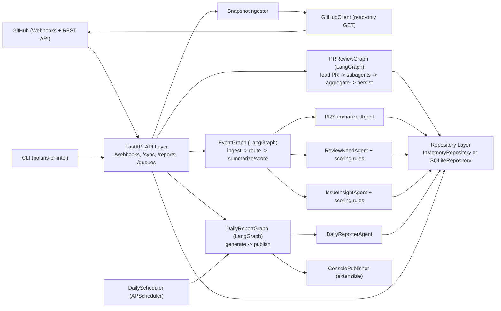
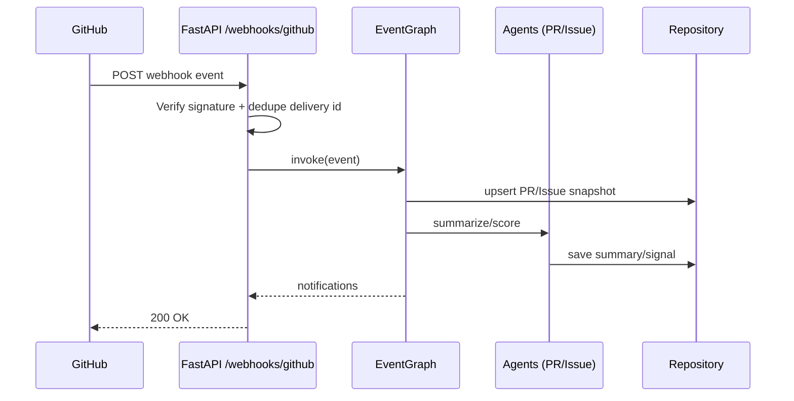
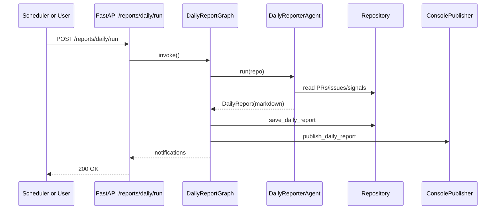

# Polaris PR Intelligence (LangGraph + GitHub API)

Python service for monitoring `apache/polaris` pull requests and issues, scoring review priority, and generating daily reports.

## Features
- GitHub webhook ingestion (`pull_request`, `issues`, `issue_comment`, `pull_request_review`)
- LangGraph event pipeline:
  - PR summarization
  - PR needs-review scoring
  - interesting-issue scoring
- Daily report pipeline
- FastAPI service endpoints
- SQLite persistence by default (`STORE_BACKEND=sqlite`)
- Provider-agnostic PR deep-review subagents (`heuristic`, `openai`, `gemini`, `anthropic`)

## Layout
- `src/polaris_pr_intel/api` - FastAPI app
- `src/polaris_pr_intel/github` - GitHub API client
- `src/polaris_pr_intel/graphs` - LangGraph workflows
- `src/polaris_pr_intel/agents` - task agents
- `src/polaris_pr_intel/ingest.py` - periodic GitHub snapshot ingestion
- `src/polaris_pr_intel/scoring` - deterministic scoring
- `src/polaris_pr_intel/store` - repository layer
- `src/polaris_pr_intel/publish` - report/notification sinks
- `src/polaris_pr_intel/scheduler` - daily scheduler

## Architecture



### Component responsibilities
- **API layer**: receives webhooks, exposes manual sync/report endpoints, and serves queue/report queries.
- **EventGraph**: processes incoming PR/issue events and writes summaries/signals.
- **DailyReportGraph**: builds and publishes daily markdown reports.
- **GitHubClient**: reads PR/issue data from GitHub API.
- **Repository layer**: persists snapshots, signals, reports, and webhook idempotency keys.
- **Scheduler**: triggers daily report runs automatically.

## Sequence flows

### 1) Webhook event processing



### 2) Daily report generation



## Run
```bash
cd /Users/yufei/projects/my-town/pr-intel
python -m venv .venv
source .venv/bin/activate
pip install -e .
export GITHUB_TOKEN=your_read_only_token
polaris-pr-intel serve --host 0.0.0.0 --port 8080
```

Open:
- `http://127.0.0.1:8080/` (service overview)
- `http://127.0.0.1:8080/ui` (dashboard UI)
- `http://127.0.0.1:8080/docs` (interactive API)

## How to use

### 1) Start service
```bash
export GITHUB_TOKEN=your_read_only_token
export STORE_BACKEND=sqlite
export SQLITE_PATH=.data/polaris_pr_intel.db
polaris-pr-intel serve --host 0.0.0.0 --port 8080
```

### 2) Sync Polaris open PRs/issues
```bash
curl -X POST "http://127.0.0.1:8080/sync/all-open?per_page=100&max_pages=20"
```

### 3) Run deep PR subagent reviews
Run one PR:
```bash
curl -X POST "http://127.0.0.1:8080/reviews/pr/123/run"
```
This endpoint auto-fetches the PR from GitHub if it is not already in local storage.
It runs asynchronously by default and returns a `job_id`.

Check async job status:
```bash
curl "http://127.0.0.1:8080/reviews/jobs/<job_id>"
```

Or fetch latest job by PR number:
```bash
curl "http://127.0.0.1:8080/reviews/pr/123/job"
```

Force synchronous execution:
```bash
curl -X POST "http://127.0.0.1:8080/reviews/pr/123/run?wait=true"
```

Run many open PRs:
```bash
curl -X POST "http://127.0.0.1:8080/reviews/run-open?limit=50"
```

### 4) Generate daily report (includes refresh by default)
```bash
curl -X POST "http://127.0.0.1:8080/reports/daily/run"
```

### 5) View results
Dashboard UI:
- `http://127.0.0.1:8080/ui`

Latest report:
```bash
curl "http://127.0.0.1:8080/reports/daily/latest.md"
```

Top deep review reports:
```bash
curl "http://127.0.0.1:8080/reviews/pr/top?limit=20"
```

## Required env vars
- `GITHUB_TOKEN` - GitHub App installation token or PAT
- `GITHUB_OWNER` (default: `apache`)
- `GITHUB_REPO` (default: `polaris`)
- `GITHUB_WEBHOOK_SECRET` (optional)

## Storage backend
- `STORE_BACKEND` (default: `sqlite`) - `memory` or `sqlite`
- `SQLITE_PATH` (default: `.data/polaris_pr_intel.db`) - used when `STORE_BACKEND=sqlite`

## Optional scoring config
- `REVIEW_NEEDED_THRESHOLD` (default: `2.0`)
- `ISSUE_INTERESTING_THRESHOLD` (default: `2.0`)
- `REVIEW_STALE_24H_POINTS` (default: `1.5`)
- `REVIEW_STALE_72H_POINTS` (default: `1.5`)
- `REVIEW_REQUESTED_POINTS` (default: `2.0`)
- `REVIEW_LARGE_DIFF_POINTS` (default: `1.5`)
- `REVIEW_MEDIUM_DIFF_POINTS` (default: `1.0`)
- `REVIEW_MANY_FILES_POINTS` (default: `1.0`)

## LLM subagent config
- `LLM_PROVIDER` (default: `claude_code_local`) - `heuristic`, `openai`, `gemini`, `anthropic`, `claude_code_local`
- `LLM_MODEL` (default: `claude-code-local`)
- `OPENAI_API_KEY` (optional)
- `GEMINI_API_KEY` (optional)
- `ANTHROPIC_API_KEY` (optional)
- `CLAUDE_CODE_CMD` (default: `claude`) - local Claude Code CLI command
- `CLAUDE_CODE_TIMEOUT_SEC` (default: `45`) - timeout for each subagent call

Note: the adapter interface is provider-agnostic. The default now uses local Claude Code CLI. If CLI execution fails or output is invalid, the adapter falls back to deterministic heuristic output.

Example local Claude Code setup:
```bash
export LLM_PROVIDER=claude_code_local
export LLM_MODEL=claude-code-local
export CLAUDE_CODE_CMD=claude
```

## API
- `GET /`
- `GET /ui`
- `POST /webhooks/github`
- `POST /reports/daily/run`
- `POST /sync/recent`
- `POST /sync/all-open`
- `POST /reviews/pr/{pr_number}/run`
- `POST /reviews/pr/{pr_number}/run-sync`
- `POST /reviews/run-open`
- `GET /reviews/jobs/{job_id}`
- `GET /reviews/pr/{pr_number}/job`
- `GET /stats`
- `GET /reports/daily/latest`
- `GET /reports/daily/latest.md`
- `GET /reports/daily`
- `GET /reviews/pr/{pr_number}/latest`
- `GET /reviews/pr/top`
- `GET /queues/needs-review`
- `GET /queues/interesting-issues`
- `GET /healthz`

## Quick workflow
1. Pull recent data from GitHub:
   - `POST /sync/all-open`
2. Generate a report:
   - `POST /reports/daily/run` (refreshes from GitHub by default)
3. View report:
   - `GET /reports/daily/latest.md`
4. Run deep review subagents on a PR:
   - `POST /reviews/pr/{pr_number}/run`
5. Run deep review subagents for many open PRs:
   - `POST /reviews/run-open?limit=50`
