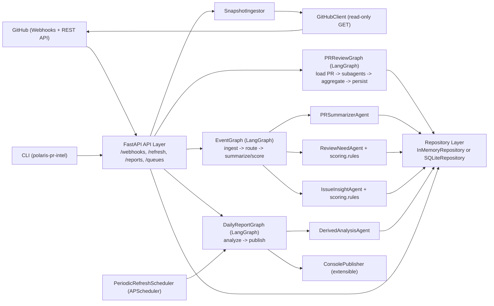
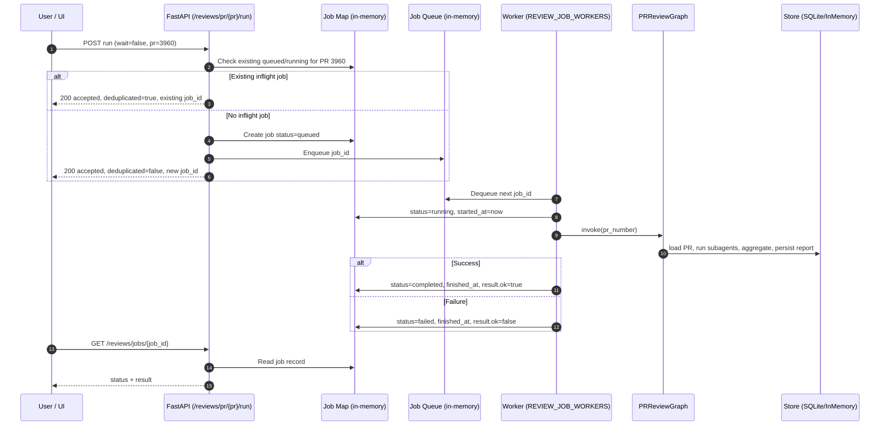
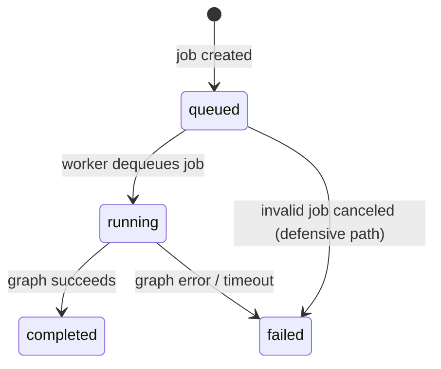
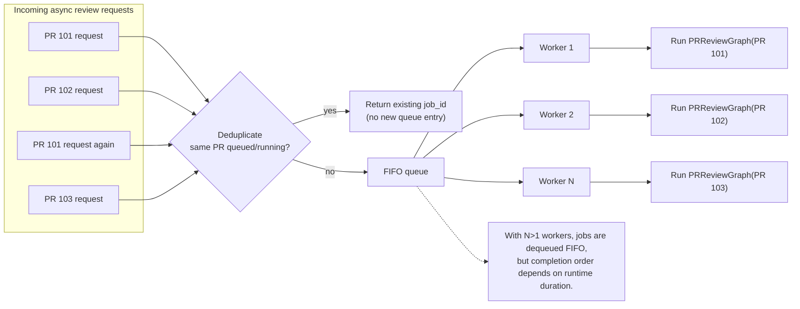

# Architecture

PR Intelligence is built as a modular system with LangGraph workflows, pluggable LLM providers, and a REST API.

## Core Components

### Graphs (LangGraph Workflows)

1. **EventGraph** - Event ingestion and processing
   - Receives GitHub webhook events (`pull_request`, `issues`, `issue_comment`, `pull_request_review`)
   - Routes events to appropriate agents
   - Summarizes and scores PRs and issues

2. **DailyReportGraph** - Analysis and reporting
   - Analyzes open PRs in batches
   - Generates attention reports
   - Creates derived artifacts

3. **PRReviewGraph** - Deep PR review
   - Loads PR details
   - Orchestrates subagent reviews
   - Aggregates findings
   - Persists review results

### Agents

- **PRSummarizerAgent** - Summarizes PR content
- **ReviewNeedAgent** - Scores PR review priority
- **IssueInsightAgent** - Scores issue priority
- **PRReviewer** - Orchestrates deep code reviews
- **DerivedAnalysisAgent** - Batch analysis across PRs

### LLM Layer

Provider-agnostic adapter layer supporting:
- **claude_code_local** - Local Claude Code CLI
- **codex_local** - Local Codex CLI
- **heuristic** - Rule-based (no LLM)

### Storage

- **SQLiteRepository** - Persistent storage (default)
- **InMemoryRepository** - Ephemeral storage (testing)

### API

FastAPI REST API with:
- Webhook ingestion
- Manual refresh triggers
- Report generation
- Async PR review queue
- Web dashboard

### Scheduler

APScheduler-based periodic refresh within configurable time windows.

## Code Layout

```
src/polaris_pr_intel/
├── api/              # FastAPI application and REST endpoints
│   ├── app.py        # Main API application
│   └── ui.py         # Web dashboard UI
├── github/           # GitHub REST API client (read-only)
│   ├── client.py     # Sync client
│   └── async_client.py
├── graphs/           # LangGraph workflows
│   ├── event_graph.py         # Event ingestion → summarize → score
│   ├── daily_report_graph.py  # Analysis → report generation
│   └── pr_review_graph.py     # Load PR → subagents → aggregate → persist
├── agents/           # Task-specific agents
│   ├── pr_summarizer.py       # PR summarization
│   ├── review_need.py         # Review priority scoring
│   ├── issue_insight.py       # Issue priority scoring
│   ├── pr_reviewer.py         # Deep PR review orchestration
│   └── derived_analysis.py    # Post-sync batch analysis
├── llm/              # Provider-agnostic LLM adapter layer
│   ├── llm_adapter.py         # LLM interface
│   ├── _heuristic.py          # Rule-based provider
│   ├── _claude_code_local.py  # Claude Code adapter
│   ├── _codex_local.py        # Codex adapter
│   ├── _base_local_cli.py     # Shared CLI logic
│   └── _utils.py              # Utilities
├── store/            # Repository layer
│   ├── base.py       # Abstract repository interface
│   ├── repository.py # In-memory implementation
│   └── sqlite_repository.py
├── scoring/          # Deterministic scoring rules
│   └── rules.py
├── scheduler/        # Periodic refresh scheduling
│   └── periodic.py
├── config.py         # Environment-based configuration
├── ingest.py         # Snapshot ingestion from GitHub
├── refresh.py        # Refresh orchestration
└── main.py           # CLI entrypoint

skills/
├── polaris-pr-review/           # Individual PR review skill
│   └── skill.md
└── polaris-attention-analysis/  # Batch PR attention analysis skill
    └── skill.md

tests/                           # Test suite (pytest)
```

## Data Flow



## Skills System

The service uses **two separate skill files** for different analysis tasks:

1. **`skills/polaris-pr-review/skill.md`** (individual PR reviews)
   - Used by `PRReviewGraph` for deep, single-PR analysis
   - Invoked via `/reviews/pr/{pr_number}/run`
   - Runs multi-turn LLM conversations with subagents for comprehensive code review

2. **`skills/polaris-attention-analysis/skill.md`** (post-sync report analysis)
   - Used by `DailyReportGraph` for batch analysis across all open PRs
   - Invoked via `/refresh`
   - Processes multiple PRs in a single LLM call for efficiency
   - Persists structured attention analysis and generates derived markdown/artifacts

This separation allows:
- Different prompting strategies for deep vs. broad analysis
- Independent skill evolution for different use cases
- Better cost/performance trade-offs per task type

## Async Review Queue Architecture

The async review queue enables parallel processing of deep PR reviews without blocking the API.

### Sequence Diagram



### Job State Machine



### Deduplication Flow



### Key Features

- **In-memory queue** - Not persisted, resets on server restart
- **Deduplication** - Repeated requests for same PR while queued/running return existing job_id
- **Parallel workers** - Configurable via `REVIEW_JOB_WORKERS` (default: 1)
- **Timeout protection** - Jobs that exceed `REVIEW_JOB_TIMEOUT_SEC` are marked as failed (default: 1200s)

## Provider Notes

- Adapter layer is provider-agnostic
- Local providers (`claude_code_local`, `codex_local`) use your local repo path for code-aware analysis
- Local providers are the only adapters that execute real external LLM/tooling calls
- Individual PR review and post-sync report analysis use different prompt paths and skills
- Post-sync report analysis batches the current open PR set into one LLM call
- If CLI execution fails or output parsing fails, adapters fall back to deterministic rule-based output
- Service logs the configured LLM provider at startup and logs each CLI invocation
