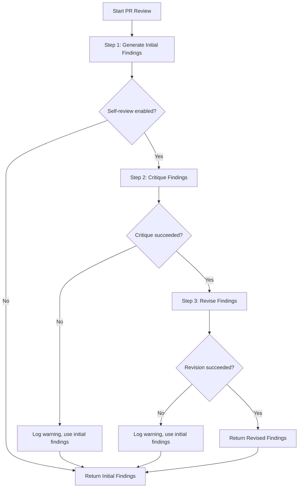

# Self-Review Feature

The self-review feature improves PR review quality through LLM critique and revision.

## Overview

When enabled on local CLI adapters (`claude_code_local` and `codex_local`), PR reviews use a 3-step process:

1. **Generate** - LLM produces initial review findings
2. **Critique** - LLM examines its own findings against quality criteria
3. **Revise** - LLM regenerates findings addressing critique issues

The `heuristic` provider uses single-pass rule-based review instead.

## How It Works

### Step 1: Generate
The LLM performs a standard PR review, analyzing:
- Code changes
- Architecture impact
- Potential issues
- Test coverage
- Documentation needs

### Step 2: Critique
The LLM reviews its own findings against quality criteria:

- **Specificity**: Are recommendations actionable with file:line references?
- **Coverage**: Were all critical checks from skill.md addressed?
- **Consistency**: Do verdicts align with scores? Any contradictions?
- **Clarity**: Is language clear and concise without hedging?

### Step 3: Revise
The LLM regenerates findings, addressing issues identified in the critique:
- Adding missing file:line references
- Covering overlooked checks
- Resolving contradictions
- Clarifying ambiguous language

### Fallback Behavior
If critique or revision fails (timeout, error, parse failure), the system falls back to initial findings. The review still completes successfully.

## When to Use

### Enable Self-Review When:
- Review quality is more important than speed
- Doing targeted reviews on critical PRs
- You have budget for 3x LLM calls per review
- Initial reviews lack specificity or have gaps

### Disable Self-Review When:
- You need fast turnaround times
- Doing bulk/batch reviews
- Cost optimization is a priority
- Initial reviews are already sufficient

## Configuration

### Enable Globally

```bash
export ENABLE_SELF_REVIEW=true
./run.sh serve
```

### Disable Globally

```bash
export ENABLE_SELF_REVIEW=false
./run.sh serve
```

### For a Single Session

```bash
ENABLE_SELF_REVIEW=true ./run.sh serve
```

## Performance Impact

### Latency
- **Without self-review**: 1x baseline time
- **With self-review**: ~3x baseline time

Each LLM call adds latency. For a typical review taking 2 minutes, self-review would take ~6 minutes.

### Cost
- **Without self-review**: 1x token usage
- **With self-review**: ~3x token usage

Three separate LLM calls means roughly 3x the API cost.

### Quality
Significantly improved:
- More specific file:line references
- Better coverage of critical checks
- Aligned verdicts and scores
- Clearer, more concise language
- Fewer contradictions

## Monitoring

### Successful Self-Review

When self-review completes successfully, logs show:

```
[INFO] Step 1/3: Generating initial review for PR #123
[INFO] Step 2/3: Critiquing initial findings for PR #123
[INFO] Step 3/3: Revising findings based on critique for PR #123
[INFO] Self-review complete for PR #123: 4 findings revised
```

### Fallback to Initial Findings

If critique or revision fails, you'll see:

```
[WARNING] Step 2 (critique) failed, using initial findings: <error>
```

or

```
[WARNING] Step 3 (revision) failed, using initial findings: <error>
```

This is **expected behavior**. The review completes with initial findings, which are still valuable.

### Common Fallback Reasons
- LLM timeout
- API error
- Parse failure (malformed output)
- Network issues

## A/B Testing

To compare quality with and without self-review:

### Run Baseline Review

```bash
export ENABLE_SELF_REVIEW=false
./run.sh serve
```

In another terminal:
```bash
./run.sh review 123
curl http://127.0.0.1:8080/reviews/pr/123/latest.md > baseline.md
```

### Run Self-Reviewed

```bash
export ENABLE_SELF_REVIEW=true
./run.sh serve
```

In another terminal:
```bash
./run.sh review 123
curl http://127.0.0.1:8080/reviews/pr/123/latest.md > self-reviewed.md
```

### Compare Results

```bash
diff baseline.md self-reviewed.md
```

Look for improvements:
- More specific file:line references in recommendations
- Better coverage of all critical checks
- Aligned verdicts and scores
- Clearer, more concise language
- Fewer hedging words (\"might\", \"could\", \"possibly\")

## Quality Criteria

The critique step evaluates findings against these criteria:

### Specificity
- Do findings reference specific files and line numbers?
- Are recommendations actionable?
- Is it clear what needs to change?

### Coverage
- Were all critical checks from the skill file addressed?
- Security considerations?
- Performance implications?
- Test coverage?
- Documentation needs?

### Consistency
- Do verdicts (approve/request changes) align with severity scores?
- Any contradictions between different findings?
- Do recommendations contradict each other?

### Clarity
- Is language clear and concise?
- Avoid hedging (\"might\", \"could\", \"possibly\")?
- Free of ambiguity?

## Best Practices

### For Critical PRs
Enable self-review and increase timeout:
```bash
export ENABLE_SELF_REVIEW=true
export REVIEW_JOB_TIMEOUT_SEC=2400  # 40 minutes
```

### For Bulk Reviews
Disable self-review for speed:
```bash
export ENABLE_SELF_REVIEW=false
export REVIEW_JOB_WORKERS=3  # Parallel processing
```

### For Cost Optimization
Use heuristic provider (no LLM calls):
```bash
export LLM_PROVIDER=heuristic
```

### Mixed Strategy
Run initial triage with heuristic provider, then deep review with self-review on high-priority PRs:

```bash
# Initial triage
export LLM_PROVIDER=heuristic
./run.sh refresh

# Deep review on specific PRs
export LLM_PROVIDER=claude_code_local
export ENABLE_SELF_REVIEW=true
./run.sh review 123
```

## Troubleshooting

### Self-Review Taking Too Long

**Expected**: Self-review is ~3x slower than baseline.

**Solutions**:
1. Increase timeout: `export REVIEW_JOB_TIMEOUT_SEC=2400`
2. Disable for faster results: `export ENABLE_SELF_REVIEW=false`

### Persistent Fallbacks

If critique/revision consistently fails:

1. Check LLM provider configuration
2. Verify API keys and access
3. Review server logs for specific errors
4. Try increasing timeout
5. Consider disabling self-review

### Quality Not Improving

If self-review doesn't seem to help:

1. Check that it's actually running (look for 3-step logs)
2. Compare baseline vs self-reviewed outputs side-by-side
3. Verify critique is identifying real issues
4. Consider adjusting skill file prompts

## Implementation Details

### Provider Support

| Provider | Self-Review Support |
|----------|--------------------|
| `claude_code_local` | ✅ Yes |
| `codex_local` | ✅ Yes |
| `heuristic` | ❌ No (rule-based) |

### Workflow



### Error Handling

The system is resilient to failures:
- Critique fails → use initial findings
- Revision fails → use initial findings
- Timeout at any step → fall back gracefully
- Parse errors → fall back gracefully

Reviews never fail completely due to self-review issues.

## Future Enhancements

### Planned
- Configurable quality criteria
- Multi-round revision (iterate until criteria met)
- Quality metrics tracking
- Automatic A/B testing

### Under Consideration
- Selective self-review (based on PR characteristics)
- Parallel critique by multiple reviewers
- Learning from human feedback
