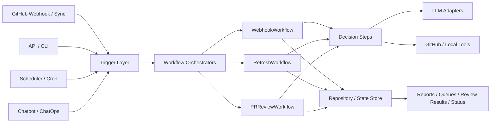

# Agent Build

This repo should be understood as a workflow-based agent system, not a toy single loop.

Useful mental model:

`input -> decision -> action -> persisted state`

In this codebase, that loop is split across a few bounded workflows instead of one open-ended agent.

## High-Level Diagram

### Inputs

The system is driven by:

- GitHub sync and webhook ingestion
- API requests
- scheduled refresh jobs
- future chatbot or ChatOps requests

Relevant code:

- `src/polaris_pr_intel/ingest.py`
- `src/polaris_pr_intel/api/app.py`
- `src/polaris_pr_intel/scheduler/periodic.py`

### Orchestration

The main control loops live in LangGraph workflows:

- `EventGraph`: ingest event -> summarize or score -> persist
- `DailyReportGraph`: analyze repo state -> render report -> publish
- `PRReviewGraph`: load PR -> review -> aggregate -> persist

Relevant code:

- `src/polaris_pr_intel/graphs/event_graph.py`
- `src/polaris_pr_intel/graphs/daily_report_graph.py`
- `src/polaris_pr_intel/graphs/pr_review_graph.py`

These graphs should stay responsible for workflow execution, not for deciding how work gets triggered.

The better abstraction is a workflow orchestrator, not a generic "agent manager".

Each orchestrator should:

- accept a typed request
- load the minimum required state
- run a bounded sequence of steps
- persist typed outputs
- return a typed result

Each orchestrator should not own:

- trigger policy
- transport concerns
- chat UX
- provider-specific CLI details

For this repo, a good target shape is:

- `RefreshWorkflow`
- `PRReviewWorkflow`
- `WebhookWorkflow`

with a shared pattern like:

- `WorkflowRequest`
- `WorkflowContext`
- `WorkflowResult`
- ordered workflow steps

The important point is that the workflow contract is the architecture. LangGraph is only one possible execution engine for that contract.

### Decision Layer

LLMs are used for judgment-heavy steps, not for owning system state.

Examples:

- batched PR attention ranking
- comprehensive PR review
- optional self-review flow

Relevant code:

- `src/polaris_pr_intel/llm/base.py`
- `src/polaris_pr_intel/llm/adapters.py`
- `src/polaris_pr_intel/llm/factory.py`
- `src/polaris_pr_intel/agents/pr_reviewer.py`
- `src/polaris_pr_intel/agents/derived_analysis.py`

### State

The repository is the source of truth. Important outputs are persisted:

- PR and issue snapshots
- rule-based signals
- PR review reports
- analysis runs

Relevant code:

- `src/polaris_pr_intel/models.py`
- `src/polaris_pr_intel/store/base.py`
- `src/polaris_pr_intel/store/sqlite_repository.py`
- `src/polaris_pr_intel/store/repository.py`

## Triggering vs Orchestration

This repo should keep agent triggering separate from agent orchestration.

Triggering is about how work starts:

- API request
- webhook event
- scheduler tick
- CLI command
- chatbot or ChatOps request

Orchestration is about how work runs once started:

- step ordering
- routing
- retries or fallbacks
- aggregation
- persistence

For this codebase, the intended split is:

- trigger layer decides `run now`, `enqueue`, `deduplicate`, or `ignore`
- graph layer executes the workflow
- repository stores the result

This matters because the same workflows should be reusable from multiple front doors. A chatbot should trigger the same backend flows as the API, not introduce a parallel execution path.

Chatbot / ChatOps belongs in the trigger layer, alongside webhooks and scheduled jobs. It is another trigger source, not a separate execution subsystem.

Typical chatbot responsibilities:

- answer status questions from persisted state
- explain why a PR is ranked highly
- summarize the latest report or review
- trigger refresh or review jobs through the same backend paths as other triggers
- propose actions before executing them

The chatbot should not keep private workflow state or duplicate backend business logic.

## Recommended Orchestrator Abstraction

The orchestrator should be modeled as a workflow runner with a small contract.

Suggested shape:

- trigger layer creates a typed workflow request
- orchestrator runs ordered steps against a workflow context
- steps call adapters, tools, and repository methods
- orchestrator persists outputs and returns a typed result

That means intelligence lives inside specific decision steps, while the orchestrator owns only flow control.

Examples of workflow steps:

- `LoadPRStep`
- `FetchDiffStep`
- `AnalyzeAttentionStep`
- `AggregateReviewStep`
- `PersistReportStep`

This gives the repo a cleaner separation:

- triggering decides when work starts
- orchestration decides how work runs
- adapters decide how model/tool calls happen
- repository decides how state is stored

This also keeps the codebase from being overly coupled to LangGraph. The graph can remain the execution mechanism, but it should not be the primary abstraction exposed to the rest of the system.

## What To Keep In Mind

The simplified idea `agent = loop + tools` is useful, but incomplete for this repo.

This system is really:

- bounded loops inside each workflow
- shared persisted state across workflows
- deterministic rules mixed with LLM judgment
- API and scheduler driven execution

Examples:

- refresh: sync -> score -> analyze -> report
- review: fetch PR if needed -> review -> aggregate -> persist
- webhook: ingest event -> route by type -> score or summarize

## Design Rules

- Keep LLMs responsible for judgment, not persistence.
- Keep triggering separate from orchestration.
- Keep orchestration in graphs or explicit workflow code.
- Keep repository state as the canonical record.
- Prefer bounded steps over open-ended conversations.
- Make fallback behavior visible.
- Add new user-facing surfaces by calling existing backend flows first.

## Bottom Line

The point of the simplified agent framing is clarity, not completeness.

For this repo, the important pieces are:

- clear workflow boundaries
- durable state
- validated model outputs
- observable execution
- tool-backed actions

That is what makes the system operational instead of just conversational.
