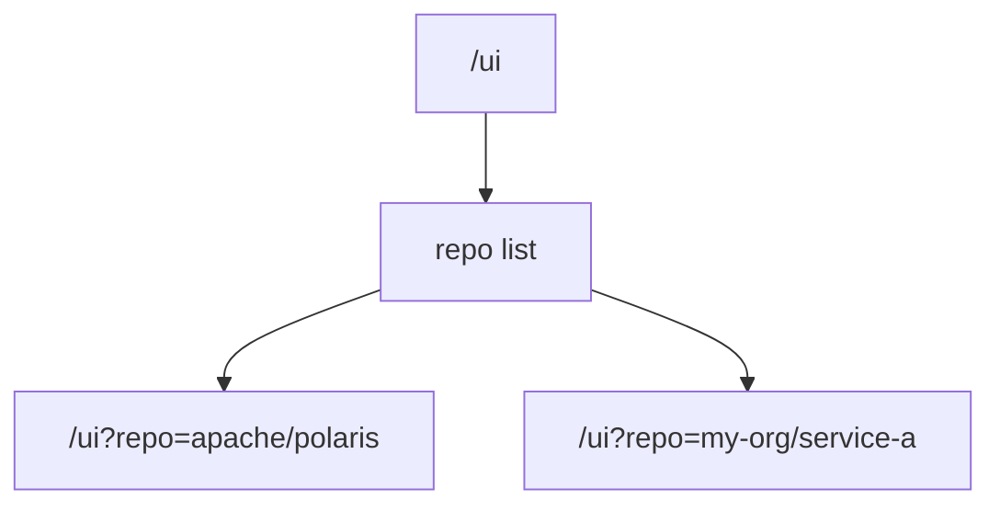
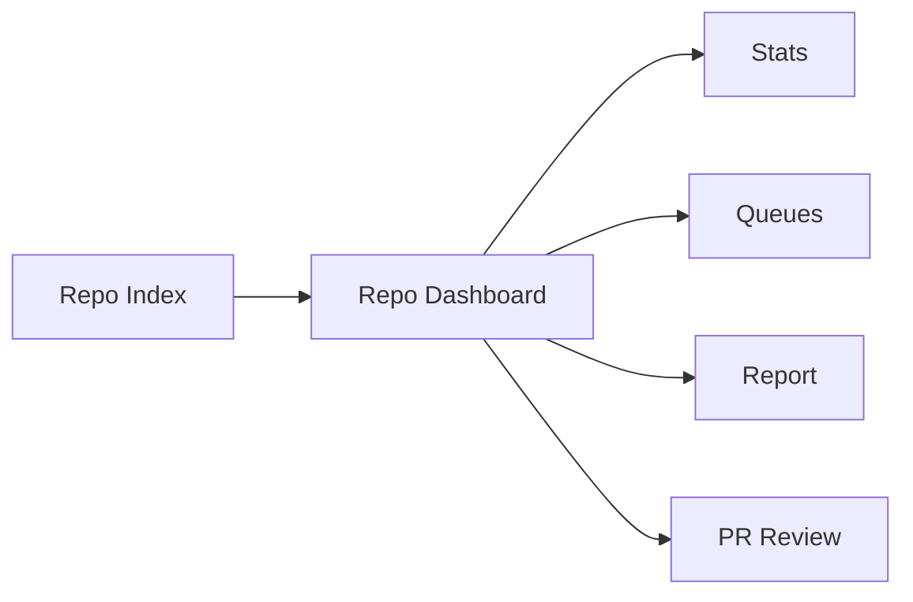

# Multi-Repo Support Plan

## Summary

Keep the product repo-scoped.

- `/ui` should be a simple repo index
- select the repo with a request parameter, not a long route prefix
- do not mix PRs from different repos into one default queue

This is the simplest path and matches how the current app already works.



## Repo Parameter

Use one required query parameter:

- `repo=owner/repo`

Example:

- `repo=apache/polaris`

Use query parameters for GET and POST.

- do not put repo identity in GET payloads
- do not repeat `/{owner}/{repo}` in every route

## Routes

Add these routes:

- `GET /repos`
- `GET /stats?repo=owner/repo`
- `POST /refresh?repo=owner/repo`
- `GET /queues/needs-review?repo=owner/repo`
- `GET /queues/interesting-issues?repo=owner/repo`
- `GET /reports/daily/latest.md?repo=owner/repo`
- `POST /reviews/pr/{pr_number}/run?repo=owner/repo`
- `POST /reviews/pr/{pr_number}/run-sync?repo=owner/repo`
- `GET /reviews/pr/{pr_number}/job?repo=owner/repo`
- `GET /reviews/pr/{pr_number}/latest?repo=owner/repo`
- `GET /reviews/pr/{pr_number}/latest.md?repo=owner/repo`
- `GET /reviews/pr/{pr_number}/latest.html?repo=owner/repo`
- `GET /reviews/pr/top?repo=owner/repo`



## UI

### `/ui`

Make `/ui` a repo list page. Each repo card should show:

- `owner/repo`
- PR count
- issue count
- needs-review count
- interesting-issues count
- last sync

### `/ui?repo=owner/repo`

Load the current dashboard here with minimal changes.

Keep the existing sections:

- PRs needing review
- new or updated PRs
- interesting issues
- deep PR reviews
- review jobs

## Data And Storage

Keep this simple in phase 1:

- one app
- one repo runtime per configured repo
- one SQLite file per repo

That avoids PR number collisions like `#123` appearing in multiple repos.

## Config

Keep single-repo env config as-is.

For multi-repo mode, add one config file listing repos and per-repo paths.

Example:

```toml
[[repos]]
owner = "apache"
repo = "polaris"
local_review_repo_dir = "/path/to/apache/polaris"
sqlite_path = ".data/apache__polaris.db"

[[repos]]
owner = "my-org"
repo = "service-a"
local_review_repo_dir = "/path/to/service-a"
sqlite_path = ".data/my-org__service-a.db"
```

## Compatibility

- if only one repo is configured, existing non-repo-scoped routes can keep working
- if multiple repos are configured, `repo` becomes required on repo-specific routes

## Implementation Steps

1. Add a small repo registry in the app layer.
2. Load multiple repo configs.
3. Create one runtime per repo.
4. Add the repo-parameter routes listed above.
5. Load the current dashboard from `/ui?repo=owner/repo`.
6. Turn `/ui` into the repo index.
7. Make review jobs repo-aware.
8. Add tests for two repos with overlapping PR numbers.

## Tests

Cover at least:

- two repos both having PR `#123`
- repo-parameter queue routes
- repo-parameter review routes
- repo index rendering
- single-repo compatibility behavior

## Recommendation

Do this first. It is much simpler than building a mixed cross-repo queue and it fits the current architecture.
