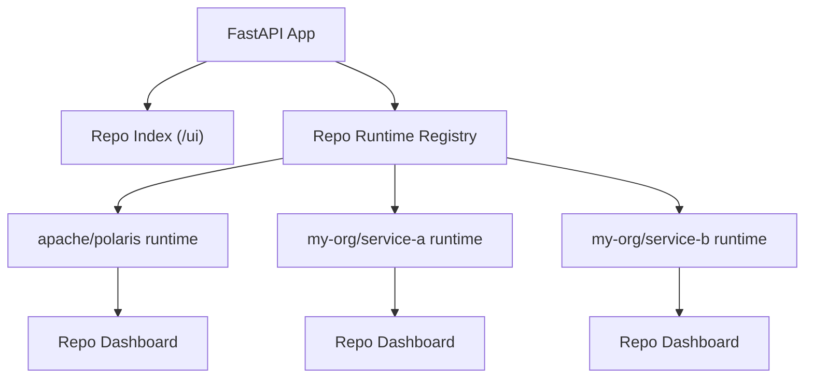
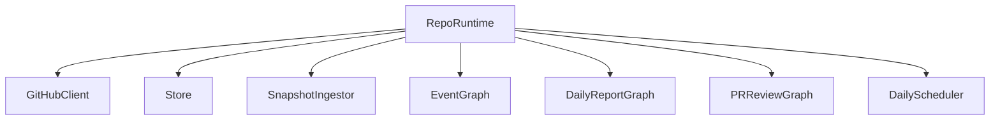
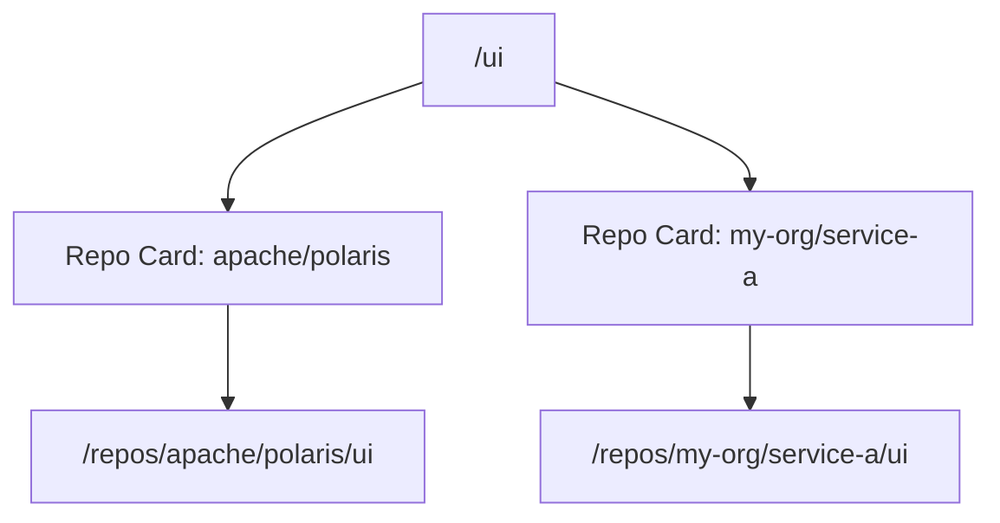
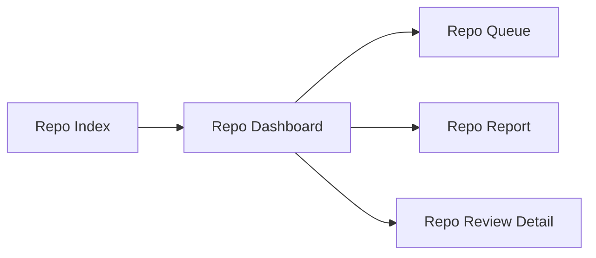
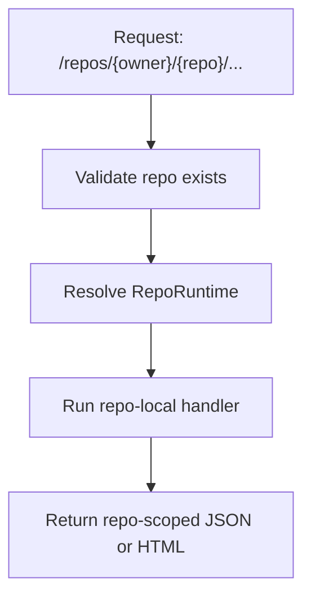
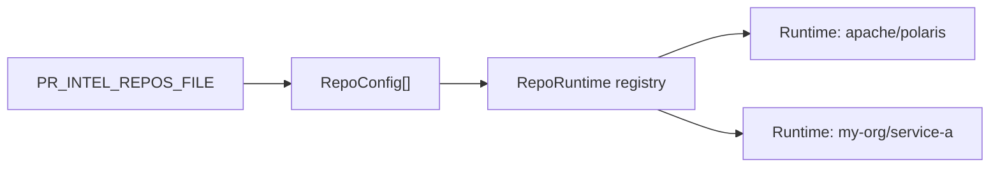
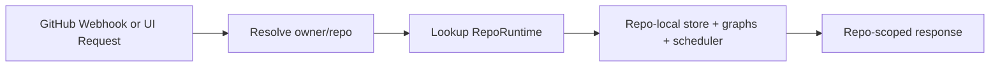
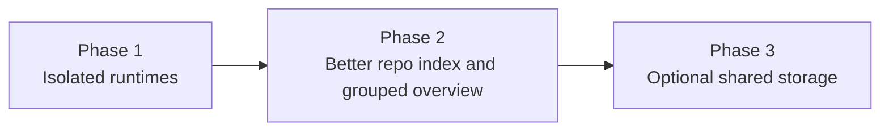

# Multi-Repo Support Plan

## Status

Proposed

## Summary

Support multiple GitHub repositories in one service without mixing them into one default queue.

The recommended shape is:

- one FastAPI app
- one isolated runtime per repo
- `/ui` as a repo index
- `/repos/{owner}/{repo}/ui` as the actual working dashboard
- one SQLite file per repo in phase 1

This keeps triage repo-scoped, avoids ambiguous PR numbers, and lets us reuse most of the current single-repo code.



## Key Decisions

- Do not mix repos into one flat inbox by default.
- Keep execution and storage isolated per repo.
- Add repo-scoped routes for dashboard, queues, reports, and reviews.
- Keep legacy repo-global routes only as aliases in single-repo mode.
- Use a TOML config file for multi-repo mode instead of repeated env vars.
- Defer a shared multi-tenant database until there is a real need.

## Why

Mixing repos creates bad defaults:

- PR `#123` is ambiguous across repos.
- queue scores are not directly comparable across repos
- last sync and latest report stop meaning one thing
- review history becomes noisy

The right default is repo isolation first, aggregate overview second.

## Runtime Shape

Add a registry of per-repo runtimes. Each runtime owns:

- `GitHubClient`
- store
- `SnapshotIngestor`
- `EventGraph`
- `DailyReportGraph`
- `PRReviewGraph`
- scheduler

Suggested model:

```python
@dataclass
class RepoRuntime:
    ref: RepoRef
    store: Repository
    gh: GitHubClient
    snapshot_ingestor: SnapshotIngestor
    event_graph: EventGraph
    daily_graph: DailyReportGraph
    pr_review_graph: PRReviewGraph
    scheduler: DailyScheduler
```

The app layer should route requests to the correct runtime by `owner/repo`.



## UI Plan

### `/ui`

Turn `/ui` into a repo index page.

Each repo card should show:

- `owner/repo`
- PR count
- issue count
- needs-review count
- interesting-issues count
- last sync
- next refresh
- latest report date



### `/repos/{owner}/{repo}/ui`

Move the current dashboard here with minimal layout change.

Keep the existing sections:

- PRs needing review
- new or updated PRs
- interesting issues
- deep PR reviews
- review jobs

### Aggregate View

If we want a cross-repo view later, make it a grouped overview, not one flat queue.



## API Plan

Add repo-scoped routes:

- `GET /repos`
- `GET /repos/{owner}/{repo}/stats`
- `POST /repos/{owner}/{repo}/refresh`
- `GET /repos/{owner}/{repo}/queues/needs-review`
- `GET /repos/{owner}/{repo}/queues/interesting-issues`
- `GET /repos/{owner}/{repo}/reports/daily/latest.md`
- `POST /repos/{owner}/{repo}/reviews/pr/{pr_number}/run`
- `POST /repos/{owner}/{repo}/reviews/pr/{pr_number}/run-sync`
- `GET /repos/{owner}/{repo}/reviews/pr/{pr_number}/job`
- `GET /repos/{owner}/{repo}/reviews/pr/{pr_number}/latest`
- `GET /repos/{owner}/{repo}/reviews/pr/{pr_number}/latest.md`
- `GET /repos/{owner}/{repo}/reviews/pr/{pr_number}/latest.html`
- `GET /repos/{owner}/{repo}/reviews/pr/top`

Compatibility rules:

- if one repo is configured, keep current routes working as aliases
- if multiple repos are configured, repo-global API routes should return `repo-required`



## Config Plan

Keep current env-based config for single-repo mode.

Add multi-repo mode via `PR_INTEL_REPOS_FILE`, pointing to a TOML file:

```toml
[[repos]]
owner = "apache"
repo = "polaris"
local_review_repo_dir = "/path/to/apache/polaris"
sqlite_path = ".data/apache__polaris.db"
webhook_secret = ""

[[repos]]
owner = "my-org"
repo = "service-a"
local_review_repo_dir = "/path/to/service-a"
sqlite_path = ".data/my-org__service-a.db"
webhook_secret = ""
```

Global provider settings can stay shared at first. Per-repo overrides can be added only where needed.



## Storage Plan

Phase 1 should use one SQLite file per repo.

Benefits:

- no PR number collisions
- minimal store changes
- lower migration risk

Do not move to one shared multi-tenant schema in phase 1.

## Webhooks And Jobs

Keep one webhook endpoint:

- `POST /webhooks/github`

Route by `payload.repository.owner.login` and `payload.repository.name`.

Review jobs must become repo-aware:

- dedupe by `(repo_full_name, pr_number)`
- include repo identity in job payloads



## Migration Plan

### Phase 1

- add `RepoRef`, `RepoConfig`, and `RepoRuntime`
- add multi-repo config loading
- build a runtime registry in `main.py`
- refactor `create_app()` to dispatch by repo
- move current dashboard to `/repos/{owner}/{repo}/ui`
- turn `/ui` into a repo index
- add repo-scoped API routes
- keep one SQLite file per repo
- make review jobs repo-aware

### Phase 2

- improve repo index cards and health states
- add repo switcher navigation
- add optional grouped aggregate views

### Phase 3

- only if needed, move to a shared multi-tenant store



## Code Touch Points

Expected files:

- `src/polaris_pr_intel/config.py`
- `src/polaris_pr_intel/main.py`
- `src/polaris_pr_intel/api/app.py`
- `src/polaris_pr_intel/models.py`
- `src/polaris_pr_intel/scheduler/daily.py`

Likely new files:

- `src/polaris_pr_intel/runtime.py`
- `src/polaris_pr_intel/config_multi.py`

## Testing

Cover at least:

- two repos with overlapping PR numbers
- repo-scoped queue and review routes
- single-repo compatibility routes
- `/ui` repo index rendering
- webhook dispatch to the right runtime
- review-job dedup by repo plus PR number

## Recommendation

Implement isolated per-repo runtimes first. It matches the current architecture, keeps the UI understandable, and avoids the product mistake of making review triage a mixed cross-repo queue.
