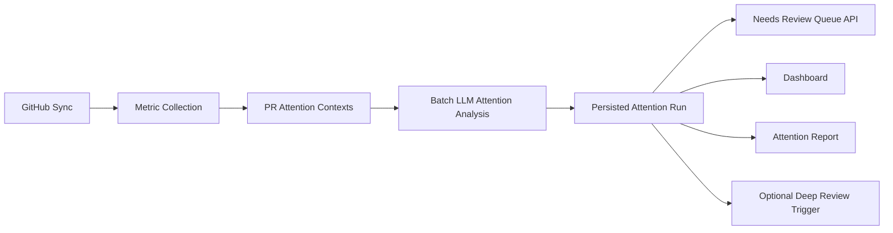

# Batch LLM-Driven PR Attention Analysis

## Status

Proposed

## Summary

Replace the current mostly heuristic PR review queue with a batch LLM-driven attention analysis pipeline. The system should gather all relevant PR metrics first, send the full open-PR set to the LLM in one compact batch, persist the ranked results, and use those persisted results as the source of truth for the review queue and attention report.

This moves repo-specific prioritization policy into the skill layer while keeping data collection, persistence, and API behavior in code.

## Goals

- Rank all open PRs relative to each other, not one PR at a time.
- Let the skill define repo-specific priority policy.
- Persist the ranked queue so the UI and API reflect the same analysis result.
- Collect all raw metrics before LLM analysis.
- Keep deep PR review separate from attention ranking.
- Support reuse across different repos by swapping the skill.

## Non-Goals

- Replacing deep single-PR review.
- Feeding full diffs for every PR into the batch attention model.
- Making the queue fully deterministic.
- Building a generic cross-repo ontology on day one.

## Current Problems

- The queue was historically derived from heuristic `review_signals`, which biased selection before analysis.
- The current LLM analysis only sees a top slice of PRs, not the full candidate set.
- Priority policy is split between code and skill.
- The UI/API queue and the generated report can diverge if they do not read the same persisted output.
- Activity metrics are only partially exposed to the model.

## Proposed Architecture

1. Sync all open PRs.
2. Gather raw metrics for every open PR.
3. Build a compact per-PR attention context.
4. Send the full PR set to the attention-analysis skill in one batch.
5. Receive a ranked list with structured outputs.
6. Persist the full ranked result.
7. Drive `/queues/needs-review`, dashboard sections, and report artifacts from the persisted analysis result.

## High-Level Flow



## Core Design Principle

Code owns facts. Skill owns judgment.

Code should collect and persist normalized signals such as timestamps, review activity counts, labels, reviewer requests, size, and prior review state. The skill should decide which signals matter most for a given repo and how to rank them.

## Data Model

Introduce a dedicated attention-analysis result instead of overloading current heuristic scoring.

Suggested models:

```python
class PRAttentionContext(BaseModel):
    pr_number: int
    title: str
    body: str
    html_url: str
    author: str
    state: str
    draft: bool
    labels: list[str]
    requested_reviewers: list[str]

    updated_at: datetime
    age_hours: float
    inactive_days: float

    comments_total: int
    review_comments_total: int
    comments_24h: int
    comments_7d: int
    reviews_24h: int
    reviews_7d: int

    commits: int
    changed_files: int
    additions: int
    deletions: int
    diff_size: int

    has_prior_review_activity: bool
    has_prior_deep_review: bool


class PRAttentionDecision(BaseModel):
    pr_number: int
    needs_review: bool
    priority_score: float
    priority_band: Literal["high", "medium", "low", "defer"]
    priority_reason: str
    defer_reason: str = ""
    tags: list[str] = Field(default_factory=list)


class AttentionAnalysisRun(BaseModel):
    run_id: str
    created_at: datetime
    source_sync_at: datetime | None = None
    skill_name: str
    skill_version: str = ""
    repo_owner: str
    repo_name: str
    decisions: list[PRAttentionDecision]
    contexts: list[PRAttentionContext]
```

## Metric Collection

All metrics must be gathered before the LLM call.

Minimum metrics for batch attention:

- PR metadata: number, title, body, author, labels, reviewers, draft/state
- Freshness: `updated_at`, `age_hours`, `inactive_days`
- Activity: comments/reviews in 24h and 7d
- Review state: prior review activity, prior saved deep review
- Change size: commits, changed files, additions, deletions, diff size

Optional later:

- author ownership or CODEOWNERS hints
- linked issues
- CI state
- merge conflicts
- file-path category summaries

## Important Constraint

For batch ranking, do not include full diffs for every PR. Token cost will explode and ranking quality will degrade.

Instead, provide compact structured metrics plus short textual summaries:

- title
- truncated body
- labels
- small set of derived signals

Deep per-PR review remains a separate step once a PR is selected.

## LLM Interface

Rename the skill to `polaris-attention-analysis`.

The batch prompt should contain:

- repo context
- prioritization instructions from the skill
- a compact structured list of all open PR contexts
- a clear response schema

Suggested output:

```json
{
  "decisions": [
    {
      "pr_number": 123,
      "needs_review": true,
      "priority_score": 9.2,
      "priority_band": "high",
      "priority_reason": "High recent review activity and broad release-risk surface.",
      "defer_reason": "",
      "tags": ["active-discussion", "release-risk"]
    }
  ]
}
```

## Prompting Guidance

The skill should instruct the model to:

- rank PRs relative to each other
- prioritize what deserves attention now
- treat inactivity as a possible deprioritization signal, not an absolute rule
- treat bursts of recent review activity as a strong attention signal
- avoid over-prioritizing old inactive PRs unless they are clearly blocked or critical
- keep reasons operational and short

## Queue Semantics

`GET /queues/needs-review` should return:

- the persisted ranked decisions from the latest attention-analysis run
- filtered to `needs_review == true`
- ordered by `priority_score desc`

This endpoint should not recompute or reinterpret priority from raw metrics.

If no attention-analysis run exists:

- either return empty with a clear status
- or use an explicit fallback mode flag

Recommendation: expose fallback explicitly rather than silently mixing sources.

## Reporting

The attention report should be derived from the same persisted decisions.

Suggested report sections:

- Review Now
- Active Discussions
- Defer For Now
- Aging PRs To Nudge
- Risk Watchlist

These sections should be projections of the persisted decisions, not fresh recomputation.

## API Changes

Add:

- `GET /analysis/attention/latest`
- `GET /analysis/attention/runs`
- `GET /queues/needs-review`

Potentially add:

- `GET /queues/requested-you`
- `GET /queues/active-discussion`

Keep current deep-review endpoints unchanged.

## Skill Rename

Rename:

- `skills/polaris-report-analysis/skill.md`

to:

- `skills/polaris-attention-analysis/skill.md`

Update:

- `analysis_skill_file` defaults
- README references
- test fixtures
- skill frontmatter name

## Migration Plan

### Phase 1

- Rename skill to `polaris-attention-analysis`
- Add attention context model
- Add batch attention analysis run model
- Keep existing heuristic review signals intact

### Phase 2

- Collect full metrics for all open PRs before analysis
- Add one-shot batch attention LLM call
- Persist decisions
- Make queue, dashboard, and report read persisted attention decisions

### Phase 3

- Remove code-owned heuristic priority weighting from the main queue path
- Keep only fallback heuristics for degraded mode

### Phase 4

- Optionally add repo-specific variants and skill prompts

## Failure Handling

If the LLM call fails:

- persist an analysis run with failure metadata, if useful
- either expose no queue or fall back to heuristics explicitly
- never silently blend partial LLM output with unrelated heuristic ordering unless marked as fallback

## Tradeoffs

Pros:

- repo-specific priority policy lives in the skill
- better relative ranking across the whole queue
- UI/API/report all share one persisted result
- easier repo portability

Cons:

- higher dependence on LLM quality
- less stable ordering across refreshes
- batch prompt/token constraints require careful context design
- harder to debug than deterministic scoring

## Open Decisions

- Should empty approval reviews count as activity?
- Should inactive but high-risk PRs be surfaced as watch instead of review now?
- Should fallback heuristics be user-visible in the UI?
- Should raw contexts be persisted inside the analysis run or stored separately?

## Recommendation

Proceed with batch LLM-driven attention analysis and make it the sole source of truth for queue ranking, but keep metric collection and persistence in code. Rename the skill to `polaris-attention-analysis` and redesign the pipeline around one-shot analysis over compact structured PR contexts, not per-PR scoring.
